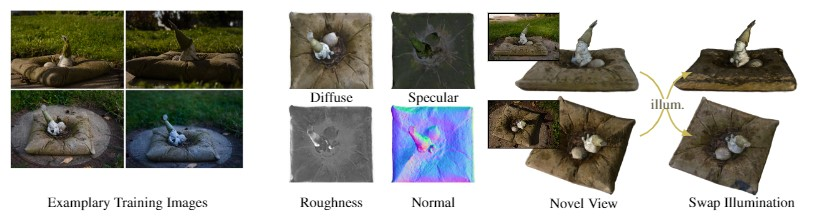

# Neural-PIL: Neural Pre-Integrated Lighting for Reflectance Decomposition

### [Project Page](https://markboss.me/publication/2021-neural-pil/) | [Video](https://youtu.be/p5cKaNwVp4M) | [Paper](https://arxiv.org/abs/2110.14373) 

Implementation for Neural-PIL. A novel method which decomposes multiple images into shape, BRDF and illumination with a split-sum preintegrated illumination network.
<br><br>
[Neural-PIL: Neural Pre-Integrated Lighting for Reflectance Decomposition](https://markboss.me/publication/2021-neural-pil/)<br>
[Mark Boss](https://markboss.me)<sup>1</sup>, [Varun Jampani](https://varunjampani.github.io)<sup>2</sup>, [Raphael Braun](https://uni-tuebingen.de/en/fakultaeten/mathematisch-naturwissenschaftliche-fakultaet/fachbereiche/informatik/lehrstuehle/computergrafik/lehrstuhl/mitarbeiter/raphael-braun/)<sup>1</sup>, [Ce Liu](http://people.csail.mit.edu/celiu/)<sup>3</sup>, [Jonathan T. Barron](https://jonbarron.info)<sup>2</sup>, [Hendrik P. A. Lensch](https://uni-tuebingen.de/en/faculties/faculty-of-science/departments/computer-science/lehrstuehle/computergrafik/computer-graphics/staff/prof-dr-ing-hendrik-lensch/)<sup>1</sup><br>
<sup>1</sup>University of Tübingen, <sup>2</sup>Google Research, <sup>3</sup>Microsoft Azure AI (work done at Google)
<br><br>



## Setup

A conda environment is used for dependency management

```
conda env create -f environment.yml
conda activate neuralpil
```

## Running

```
python train_neural_pil.py --datadir [DIR_TO_DATASET_FOLDER] --basedir [TRAIN_DIR] --expname [EXPERIMENT_NAME] --gpu [COMMA_SEPARATED_GPU_LIST]
```

### Specific Arguments per Dataset

Most setup is handled by configurations files located in [configs/neural_pil/](configs/neural_pil/).

#### Our Synthethic Scenes

```
--config configs/neural_pil/blender.txt
```

#### NeRF Synthethic Scenes

```
--config configs/neural_pil/nerf_blender.txt
```

#### Real-World

```
--config configs/neural_pil/real_world.txt
```

Often objects are captured in a spherical manner and the flag `--spherify` should be applied for those scenes.

## Datasets

All datasets are taken from [NeRD](https://github.com/cgtuebingen/NeRD-Neural-Reflectance-Decomposition#datasets).

## Run Your Own Data

Mainly camera poses and segmentation masks are required. For the poses the scripts from [NeRF](https://github.com/bmild/nerf#generating-poses-for-your-own-scenes) are used to prepare the scenes. The dataset then needs to be put in the following file structure:

```
images/
    [IMG_NAME_1].jpg
    [IMG_NAME_2].jpg
    ...
masks/
    [IMG_NAME_1].jpg
    [IMG_NAME_2].jpg
    ...
poses_bounds.npy
```

The `poses_bounds.npy` is generated from the [LLFF script](https://github.com/bmild/nerf#dont-have-poses).

## Evaluation

The [train_neural_pil.py](train_neural_pil.py) can be called with a `--render_only` flag and the `--config` flag pointing to the `args.txt` of the experiments folder.

## Citation

```
@inproceedings{boss2021neuralpil,
  title         = {Neural-PIL: Neural Pre-Integrated Lighting for Reflectance Decomposition},
  author        = {Boss, Mark and Jampani, Varun and Braun, Raphael and Liu, Ce and Barron, Jonathan T. and Lensch, Hendrik P.A.},
  booktitle     = {Advances in Neural Information Processing Systems (NeurIPS)},
  year          = {2021},
}
```